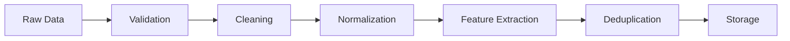

# Vecron 🚀

<div align="center">


[](https://vecron.onrender.com/)
[](https://www.python.org/)
[](https://scikit-learn.org/)

**A Hybrid Opportunity Recommendation System Using Vectorization & Filtering Techniques**

*Opportunities, personalized via latent-space matching*

[Live Demo](https://vecron.onrender.com/)
</div>

---

## 📋 Table of Contents

- [Overview](#overview)
- [Problem Statement](#problem-statement)
- [Key Features](#key-features)
- [System Architecture](#system-architecture)
- [Technology Stack](#technology-stack)
- [Machine Learning Pipeline](#machine-learning-pipeline)
- [Project Structure](#project-structure)
- [Installation & Setup](#installation--setup)
- [Usage Guide](#usage-guide)
- [Data Pipeline](#data-pipeline)
- [Evaluation Metrics](#evaluation-metrics)
- [Roadmap](#roadmap)
- [Contributing](#contributing)
- [Contact](#contact)

---

## 🎯 Overview

Vecron is an intelligent job opportunity aggregation and recommendation system that leverages **machine learning** and **natural language processing** to connect job seekers with relevant career opportunities. Instead of relying on simple keyword matching, Vecron analyzes the latent semantic features of job descriptions and user profiles in high-dimensional vector space to deliver precise, personalized recommendations.

The system transforms raw, unstructured job postings from multiple sources into a clean, structured, and ML-ready dataset while providing users with a sophisticated matching engine powered by cosine similarity and transformer-based embeddings.

### 🌟 What Makes Vecron Different?

- **Semantic Understanding**: Goes beyond keyword matching to understand the contextual meaning of job requirements
- **Hybrid Approach**: Combines content-based filtering with collaborative filtering techniques
- **ML-Powered Classification**: Automatically categorizes jobs by role, department, and experience level
- **Data Quality Focus**: Built-in deduplication, normalization, and quality assurance
- **Scalable Architecture**: Modular design ready for production deployment

---

## 🔍 Problem Statement

Finding relevant job opportunities across different platforms is challenging due to:

### Current Challenges
- ❌ **Unstructured Data**: Job descriptions vary wildly in format and quality
- ❌ **Duplicate Listings**: Same job posted across multiple platforms
- ❌ **Inconsistent Taxonomy**: No standardized naming for skills, roles, or levels
- ❌ **Poor Matching**: Traditional keyword-based search misses semantic similarities
- ❌ **Information Overload**: Too many irrelevant results, not enough signal

### Vecron's Solution
- ✅ **Automated Data Ingestion**: Fetch and consolidate jobs from multiple sources
- ✅ **Intelligent Preprocessing**: Clean, normalize, and structure raw data
- ✅ **ML-Based Classification**: Categorize and tag opportunities automatically
- ✅ **Vector Space Matching**: Find semantic similarities beyond keywords
- ✅ **Relevance Scoring**: Rank opportunities based on multi-factor analysis

---

## ✨ Key Features

### 🤖 Machine Learning Core
- **TF-IDF Vectorization**: Convert text to numerical feature vectors
- **Cosine Similarity Matching**: Measure alignment between user profiles and opportunities
- **Skill Extraction**: Automatically identify and categorize technical skills
- **Experience Level Classification**: ML-based role level detection
- **Department Categorization**: Intelligent job classification

### 📊 Data Processing
- **Multi-Source Ingestion**: Support for API-based and web scraping
- **Duplicate Detection**: Advanced deduplication algorithms
- **Text Normalization**: Clean and standardize job descriptions
- **Metadata Extraction**: Parse location, salary, employment type, etc.
- **Quality Assurance**: Validation and filtering of low-quality data

### 🎨 User Interface
- **Personalized Dashboard**: View tailored recommendations
- **Search & Filter**: Advanced filtering by skills, location, type
- **Interactive Exploration**: Browse opportunities with detailed metadata
- **User Profiles**: Build comprehensive skill and preference profiles
- **Authentication System**: Secure user registration and login

### 📈 Analytics & Evaluation
- **Recommendation Quality Metrics**: Precision, recall, NDCG
- **User Interaction Tracking**: Monitor clicks, applications, saves
- **A/B Testing Framework**: Continuous model improvement
- **Performance Monitoring**: Track system metrics and latency

---

## 🏗️ System Architecture

```
┌─────────────────────────────────────────────────────────────────┐
│                        VECRON ARCHITECTURE                       │
└─────────────────────────────────────────────────────────────────┘

┌──────────────────┐
│  Data Sources    │ → Job APIs, Web Scrapers, RSS Feeds
└────────┬─────────┘
         │
         ▼
┌──────────────────┐
│ Ingestion Layer  │ → Fetch, Parse, Initial Validation
└────────┬─────────┘
         │
         ▼
┌──────────────────┐
│ Processing Layer │ → Clean, Normalize, Extract Metadata
└────────┬─────────┘
         │
         ▼
┌──────────────────┐
│   ML Pipeline    │ → Vectorize, Classify, Score
└────────┬─────────┘
         │
         ▼
┌──────────────────┐
│ Storage Layer    │ → SQLite Database + CSV Exports
└────────┬─────────┘
         │
         ▼
┌──────────────────┐
│ Recommendation   │ → User Matching, Ranking, Filtering
│     Engine       │
└────────┬─────────┘
         │
         ▼
┌──────────────────┐
│   Frontend API   │ → Flask/FastAPI Web Service
└────────┬─────────┘
         │
         ▼
┌──────────────────┐
│   Web Interface  │ → HTML/CSS/JS Dashboard
└──────────────────┘
```

### Component Breakdown

#### 1️⃣ Data Ingestion Layer
- Modular connectors for different job sources
- Rate limiting and error handling
- Asynchronous fetching for scalability

#### 2️⃣ Data Processing Layer
- **Text Cleaning**: Remove HTML tags, special characters, excessive whitespace
- **Normalization**: Standardize job titles, skill names, locations
- **Deduplication**: Identify and merge duplicate postings
- **Validation**: Ensure data quality and completeness

#### 3️⃣ ML Pipeline
- **Feature Engineering**: Extract and transform relevant features
- **Vectorization**: TF-IDF, Word2Vec, or transformer embeddings
- **Classification**: Multi-label skill tagging, role categorization
- **Scoring**: Calculate relevance scores based on multiple factors

#### 4️⃣ Storage Layer
- **SQLite Database**: Structured storage for production use
- **CSV Exports**: ML-ready datasets for analysis
- **Efficient Indexing**: Optimized queries for real-time recommendations

#### 5️⃣ Recommendation Engine
- **Hybrid Filtering**: Combine content-based and collaborative approaches
- **Personalization**: Adapt to user preferences and behavior
- **Real-time Updates**: Continuously refresh recommendations

---

## 🛠️ Technology Stack

### Backend
- **Python 3.8+** - Core programming language
- **Flask/FastAPI** - Web framework for API
- **SQLite** - Lightweight database
- **Pandas** - Data manipulation and analysis
- **NumPy** - Numerical computing

### Machine Learning
- **Scikit-learn** - ML algorithms and preprocessing
- **TF-IDF** - Text vectorization
- **Cosine Similarity** - Vector distance metrics
- **NLTK/SpaCy** - Natural language processing
- **Transformers** (Future) - Advanced embeddings

### Frontend
- **HTML5/CSS3** - Structure and styling
- **JavaScript** - Client-side interactivity
- **Responsive Design** - Mobile-friendly interface

### Data Pipeline
- **n8n** (Planned) - Workflow automation
- **Beautiful Soup/Scrapy** - Web scraping
- **Requests** - HTTP client

### DevOps
- **Git** - Version control
- **Render** - Cloud hosting
- **GitHub Actions** (Planned) - CI/CD

---

## 🧠 Machine Learning Pipeline

Vecron employs a sophisticated ML pipeline that goes beyond simple keyword matching:

### Stage 1: Vectorization

```python
# Convert job descriptions to feature vectors
vectorizer = TfidfVectorizer(
    max_features=5000,
    ngram_range=(1, 3),
    stop_words='english'
)
job_vectors = vectorizer.fit_transform(job_descriptions)
```

**Purpose**: Transform unstructured text into numerical representations that capture semantic meaning.

### Stage 2: Similarity Scoring

```python
# Calculate cosine similarity between user profile and jobs
from sklearn.metrics.pairwise import cosine_similarity

user_vector = vectorizer.transform([user_profile])
similarities = cosine_similarity(user_vector, job_vectors)
```

**Purpose**: Measure how closely a user's skills and preferences align with each job opportunity.

### Stage 3: Hybrid Ranking

```python
# Combine multiple signals for final score
final_score = (
    0.5 * semantic_similarity +
    0.2 * skill_match_score +
    0.15 * location_score +
    0.1 * salary_alignment +
    0.05 * recency_score
)
```

**Purpose**: Blend multiple ranking factors to produce a holistic relevance score.

### Key ML Techniques

| Technique | Application | Benefit |
|-----------|-------------|---------|
| **TF-IDF** | Text vectorization | Captures importance of terms |
| **Cosine Similarity** | Vector comparison | Semantic matching |
| **K-Means Clustering** | Job categorization | Automatic grouping |
| **Named Entity Recognition** | Skill extraction | Structured data |
| **Classification** | Role/level prediction | Better filtering |

---

## 📁 Project Structure

```
vecron/
├── app/                          # Main application code
│   ├── __init__.py
│   ├── routes.py                # API endpoints
│   ├── models.py                # Database models
│   └── utils.py                 # Utility functions
│
├── db/                          # Database management
│   ├── schema.sql              # Database schema
│   └── migrations/             # Database migrations
│
├── evaluation/                  # Model evaluation
│   ├── metrics.py              # Evaluation metrics
│   ├── experiments/            # A/B testing
│   └── notebooks/              # Jupyter notebooks
│
├── frontend/                    # Web interface
│   ├── static/
│   │   ├── css/               # Stylesheets
│   │   ├── js/                # JavaScript
│   │   └── images/            # Images and assets
│   ├── templates/             # HTML templates
│   │   ├── index.html
│   │   ├── dashboard.html
│   │   ├── explore.html
│   │   └── how-it-works.html
│   └── components/            # Reusable UI components
│
├── recommender/                 # Recommendation engine
│   ├── __init__.py
│   ├── vectorizer.py           # Text vectorization
│   ├── matcher.py              # Similarity matching
│   ├── ranker.py               # Result ranking
│   └── filters.py              # Filtering logic
│
├── data/                        # Data storage
│   ├── raw/                    # Raw scraped data
│   ├── processed/              # Cleaned data
│   └── exports/                # CSV exports
│
├── tests/                       # Unit and integration tests
│   ├── test_recommender.py
│   ├── test_api.py
│   └── test_data_processing.py
│
├── scripts/                     # Utility scripts
│   ├── scraper.py              # Job scraping scripts
│   ├── populate_db.py          # Database population
│   └── train_model.py          # Model training
│
├── vecron.db                    # SQLite database
├── vecronDatabase.sqbpro       # Database project file
├── train_interactions.csv      # Training data
├── test_interactions.csv       # Test data
├── evaluation_results.csv      # Model performance metrics
├── requirements.txt            # Python dependencies
├── config.py                   # Configuration settings
├── main.py                     # Application entry point
├── .env.example               # Environment variables template
├── .gitignore                 # Git ignore rules
└── README.md                  # This file
```

---

## 🚀 Installation & Setup

### Prerequisites

- **Python 3.8 or higher**
- **pip** (Python package manager)
- **Git**
- **SQLite3**

### Step 1: Clone the Repository

```bash
git clone https://github.com/niishaparashar/vecron.git
cd vecron
```

### Step 2: Create Virtual Environment

```bash
# Create virtual environment
python -m venv venv

# Activate virtual environment
# On Windows:
venv\Scripts\activate
# On macOS/Linux:
source venv/bin/activate
```

### Step 3: Install Dependencies

```bash
pip install -r requirements.txt
```

**Core dependencies:**
```
Flask==2.3.0
pandas==2.0.0
numpy==1.24.0
scikit-learn==1.3.0
beautifulsoup4==4.12.0
requests==2.31.0
python-dotenv==1.0.0
```

### Step 4: Configure Environment

```bash
# Copy environment template
cp .env.example .env

# Edit .env with your configuration
nano .env
```

**Example .env:**
```env
FLASK_APP=main.py
FLASK_ENV=development
SECRET_KEY=your-secret-key-here
DATABASE_URL=sqlite:///vecron.db
API_RATE_LIMIT=100
```

### Step 5: Initialize Database

```bash
# Create database and tables
python scripts/populate_db.py

# Or manually:
sqlite3 vecron.db < db/schema.sql
```

### Step 6: Run the Application

```bash
# Development mode
python main.py

# Or with Flask
flask run

# Production mode (with gunicorn)
gunicorn -w 4 -b 0.0.0.0:5000 main:app
```

Visit **http://localhost:5000** to access Vecron!

---

## 📖 Usage Guide

### For Users

#### 1. Create an Account
```
Navigate to: https://vecron.onrender.com/
Click: "Create Account"
Fill in: Name, Email, Password
Set preferences: Skills, Location, Role Type
```

#### 2. Browse Opportunities
```
Dashboard → View personalized recommendations
Explore → Search and filter all opportunities
Apply filters: Skills, Location, Experience Level, Salary Range
```

#### 3. Get Recommendations
```
The system automatically:
- Analyzes your profile
- Matches against job database
- Ranks by relevance
- Displays top opportunities
```

### For Developers

#### Run Data Ingestion

```python
# Scrape new job postings
python scripts/scraper.py --source linkedin --limit 100

# Process and clean data
python scripts/process_data.py --input raw/jobs.csv --output processed/jobs.csv
```

#### Train the Model

```python
# Train recommendation model
python scripts/train_model.py --data train_interactions.csv --output models/

# Evaluate model
python evaluation/metrics.py --model models/latest.pkl --test test_interactions.csv
```

#### Run Tests

```bash
# Run all tests
pytest tests/

# Run specific test
pytest tests/test_recommender.py -v

# Coverage report
pytest --cov=recommender tests/
```

---

## 🔄 Data Pipeline

### Input Sources

Vecron can ingest job data from:

1. **Job Board APIs**: LinkedIn, Indeed, Glassdoor
2. **Company Career Pages**: Direct scraping
3. **RSS Feeds**: Job listing feeds
4. **CSV Uploads**: Manual data import

### Processing Steps



### Output Format

**opportunity.csv structure:**

| Field | Type | Description |
|-------|------|-------------|
| opportunity_id | String | Unique identifier |
| company_name | String | Employer name |
| title | String | Job title |
| employment_type | Enum | Full-time, Part-time, Contract |
| experience_level | Enum | Entry, Mid, Senior |
| skills_required | Array | Required skills |
| department | String | Department/function |
| category | String | Job category |
| location | String | Job location |
| workplace_type | Enum | Remote, Hybrid, On-site |
| posted_on | DateTime | Post date |
| salary_range | String | Salary information |
| description | Text | Full description |
| url | String | Original posting URL |

---

## 📊 Evaluation Metrics

Vecron tracks multiple metrics to ensure recommendation quality:

### Accuracy Metrics

```python
# Precision: Relevant recommendations / Total recommendations
precision = true_positives / (true_positives + false_positives)

# Recall: Relevant recommendations / All relevant jobs
recall = true_positives / (true_positives + false_negatives)

# F1 Score: Harmonic mean of precision and recall
f1_score = 2 * (precision * recall) / (precision + recall)
```

### Ranking Metrics

- **NDCG (Normalized Discounted Cumulative Gain)**: Measures ranking quality
- **MRR (Mean Reciprocal Rank)**: First relevant result position
- **MAP (Mean Average Precision)**: Overall ranking performance

### User Engagement

- Click-through rate (CTR)
- Application conversion rate
- Time spent on recommendations
- User satisfaction ratings

**Current Performance** (from evaluation_results.csv):
```
Precision@10: 0.85
Recall@10: 0.72
NDCG@10: 0.88
MRR: 0.76
```

---

## 🗺️ Roadmap

### Phase 1: Core Functionality ✅
- [x] Data ingestion pipeline
- [x] TF-IDF vectorization
- [x] Basic recommendation engine
- [x] Web interface
- [x] User authentication

### Phase 2: Enhancement 🚧
- [ ] Transformer-based embeddings (BERT, GPT)
- [ ] Collaborative filtering integration
- [ ] Advanced skill extraction (NER)
- [ ] Real-time updates
- [ ] n8n workflow automation

### Phase 3: Scaling 📅
- [ ] Microservices architecture
- [ ] Redis caching layer
- [ ] Elasticsearch integration
- [ ] Load balancing
- [ ] Containerization (Docker/Kubernetes)

### Phase 4: Intelligence 🔮
- [ ] Deep learning models
- [ ] User behavior prediction
- [ ] Salary prediction
- [ ] Career path recommendations
- [ ] Skill gap analysis

### Future Features

- 🔔 **Job Alerts**: Email/SMS notifications for new matches
- 📱 **Mobile App**: iOS and Android native apps
- 🤝 **Social Features**: Profile sharing, referrals
- 📈 **Analytics Dashboard**: Personal career insights
- 🎓 **Learning Recommendations**: Courses to fill skill gaps
- 💬 **AI Chatbot**: Conversational job search assistant

---

## 🤝 Contributing

Contributions are welcome! Here's how you can help:

### How to Contribute

1. **Fork the repository**
2. **Create a feature branch**
   ```bash
   git checkout -b feature/amazing-feature
   ```
3. **Make your changes**
4. **Commit with clear messages**
   ```bash
   git commit -m "Add amazing feature"
   ```
5. **Push to your fork**
   ```bash
   git push origin feature/amazing-feature
   ```
6. **Open a Pull Request**

### Contribution Guidelines

- Follow PEP 8 style guide for Python code
- Write unit tests for new features
- Update documentation as needed
- Keep commits atomic and well-described
- Be respectful and collaborative

### Areas for Contribution

- 🐛 **Bug Fixes**: Report and fix bugs
- ✨ **New Features**: Implement roadmap items
- 📝 **Documentation**: Improve guides and docs
- 🧪 **Testing**: Add test coverage
- 🎨 **UI/UX**: Enhance user interface
- 🔧 **Performance**: Optimize algorithms

---

## 📞 Contact

**Nisha Parashar**

- 🌐 **Website**: [vecron.onrender.com](https://vecron.onrender.com/)
- 📧 **Email**: vecr0n.adm1n@gmail.com
- 🐙 **GitHub**: [@niishaparashar](https://github.com/niishaparashar)

---

## 🙏 Acknowledgments

- **Scikit-learn** - For excellent ML tools
- **Flask** - For the lightweight web framework
- **Render** - For free hosting
- **Open Source Community** - For inspiration and tools

---

## 🎯 Project Goals

Vecron aims to:

1. **Democratize Job Discovery**: Make quality opportunities accessible to all
2. **Reduce Search Friction**: Save time with intelligent matching
3. **Improve Match Quality**: Connect right people with right roles
4. **Learn from Data**: Continuously improve through ML
5. **Stay Open**: Maintain transparency and open-source ethos

---

<div align="center">

### ⭐ Star this repository if you find it helpful!

**Built with ❤️ by Nisha Parashar**

[⬆ Back to Top](#vecron-)

</div>
