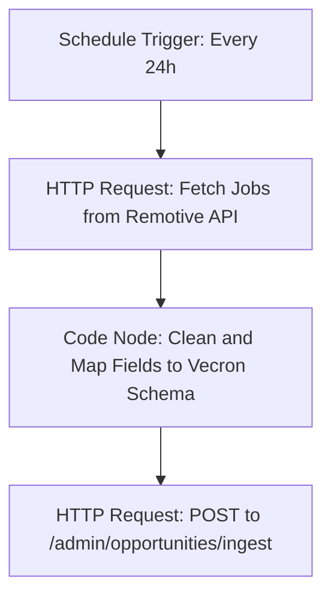

# n8n Opportunity Automation Setup & Deployment Guide

This directory contains the automation workflow for fetching remote job opportunities every 24 hours, normalizing the fields, and pushing them to Vecron's hybrid recommendation engine.

## How It Works



---

## 1. Prerequisites
- A running n8n instance (self-hosted Docker, n8n Cloud, or local desktop app).
- A deployed Vecron instance (e.g., on Render or running locally).

---

## 2. n8n Import & Configuration

### Importing the Workflow
1. Log into your n8n workspace.
2. In the left navigation, click on **Workflows** -> **Add workflow** (or click the top-right options icon `...` on an empty workflow page).
3. Select **Import from File** and upload [opportunity_ingest_workflow.json](file:///c:/Users/nisha/Downloads/github/vecron/vecron/n8n/opportunity_ingest_workflow.json).
4. Open the imported workflow and make sure the **Active** toggle is turned on. The 24-hour schedule will not run while the workflow is inactive.

### Setting Up Environment Variables in n8n
This workflow uses environment variables for secure communication. You should configure these in your n8n environment or host:
- `VECRON_API_BASE_URL`: The URL of your deployed Vecron backend (e.g. `https://vecron.onrender.com` or `http://localhost:8000`). Do not include a trailing slash.
- `N8N_INGESTION_KEY`: A strong shared secret of your choice (e.g. a random UUID). This must match the backend variable.
- `JOBS_SOURCE_URL` *(Optional)*: An override URL to fetch jobs. Defaults to Remotive API.

> [!NOTE]
> If your n8n instance doesn't support system environment variables, you can double-click the **Fetch Jobs** and **Push to VECRON** nodes in n8n to directly replace the expression fields (e.g. set the URL and headers manually).

---

## 3. Backend Setup

For the Vecron backend to authorize the automated pushes, configure these environment variables on your server (e.g. Render environment config):

| Variable | Description | Example / Recommended Value |
| :--- | :--- | :--- |
| `N8N_INGESTION_KEY` | Must match the `N8N_INGESTION_KEY` in n8n. | `<your-strong-shared-secret>` |
| `DB_PATH` | Path to persistent SQLite DB. | `/var/data/vecron.db` |
| `SESSION_SECRET` | Secret used to sign Starlette sessions. | `<random-session-secret>` |

---

## 4. Local Smoke Test (PowerShell)

You can run a local smoke test using the PowerShell script [test_ingest.ps1](file:///c:/Users/nisha/Downloads/github/vecron/vecron/n8n/test_ingest.ps1).

1. Start your local FastAPI backend server:
   ```bash
   .\run-dev.ps1
   ```
2. Open a PowerShell terminal and navigate to the `n8n` directory:
   ```powershell
   cd n8n
   ```
3. Run the script with your local API URL and ingestion key:
   ```powershell
   $env:N8N_INGESTION_KEY = "your-shared-secret"
   .\test_ingest.ps1 -ApiBaseUrl "http://localhost:8006"
   ```
4. Verify that the terminal outputs `Ingestion success` along with the number of inserted and updated jobs.

---

## 5. Render Production Deployment

To ensure that job data, users, and recommendations persist across redeploys, follow these steps in your Render Dashboard:
1. Go to your Vecron Web Service.
2. Under **Advanced**, click **Add Disk**.
3. Configure the disk:
   - **Name**: `vecron-db-data`
   - **Mount Path**: `/var/data`
   - **Size**: `1 GiB`
4. Go to **Environment Variables** and add:
   - `DB_PATH = /var/data/vecron.db`
   - `N8N_INGESTION_KEY = <your-secret>`
   - `SESSION_SECRET = <your-session-secret>`
5. Save the configuration. This will redeploy the application with persistent storage.
